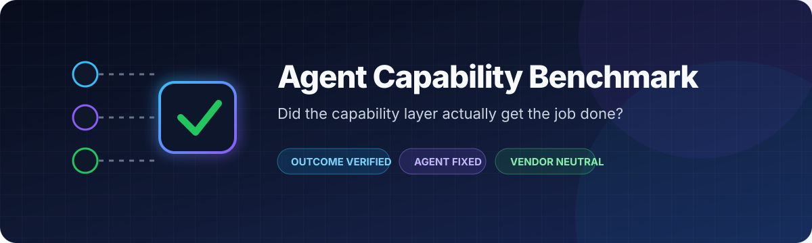
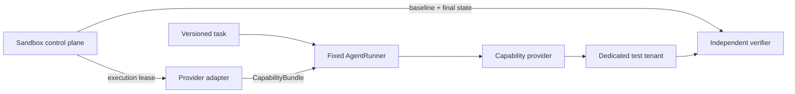

<p align="center">
  
</p>

<p align="center">
  <strong>Outcome-verified evaluation for agent capability infrastructure.</strong><br />
  Hold the agent fixed. Change the capability provider. Verify what actually happened.
</p>

<p align="center">
  <a href="https://github.com/MiltonHeYan/agent-capability-benchmark/actions/workflows/ci.yml"></a>
  <a href="LICENSE"></a>
  <a href="pyproject.toml"></a>
  <a href="tasks/public"></a>
  <a href="#project-status"></a>
  <a href="https://github.com/MiltonHeYan/agent-capability-benchmark/stargazers"></a>
</p>

Agent Capability Benchmark measures whether capability infrastructure lets a fixed AI agent complete real, externally verifiable work. It evaluates the full path from capability discovery and account connection to execution, recovery, policy compliance, and final state—not self-reported integration counts or success claims.

> [!IMPORTANT]
> This project is pre-alpha. The contracts and reference runtime are executable; production test-tenant backends and official provider results are not published yet.

If this is a problem you want solved, [star the repository](https://github.com/MiltonHeYan/agent-capability-benchmark) and join the [design discussions](https://github.com/MiltonHeYan/agent-capability-benchmark/discussions).

## Quick start

Requirements: Python 3.11 or newer.

```bash
git clone https://github.com/MiltonHeYan/agent-capability-benchmark.git
cd agent-capability-benchmark
python -m venv .venv && source .venv/bin/activate
python -m pip install -e ".[dev]"
make check
```

Validate the public task suite:

```bash
capability-bench validate tasks/public
```

## The benchmark contract

| | Fixed inside a comparison block | Varied | Independently verified |
|---|---|---|---|
| **What** | Agent runner, model, prompt, task, fixture, limits, verifier | Capability provider and its thin adapter | External state, policy boundaries, duplicates, cost ceilings |
| **Why** | Isolate the capability layer's contribution | Compare like with like | Prevent false success from becoming a pass |

An agent saying “done” is never sufficient evidence. A run passes only when the trusted verifier observes the declared outcome.

## How it works



The execution plane receives only run-scoped capability handles. Verifier and cleanup credentials stay in the trusted control plane. Each external object is namespaced by `run_id`, and final-state collection still runs after timeouts or transport failures.

## What is measured

- **Verified completion** — did the expected external state actually exist?
- **Discovery and schemas** — could the agent find and correctly call the capability?
- **Authentication** — were the correct account, scope, and recovery path used?
- **Safety and governance** — were approval, data, and spending boundaries respected?
- **Recovery and idempotency** — did retries avoid duplicate or contradictory side effects?
- **Operational quality** — latency, calls, retries, tokens, and observable cost.

Optional tracks cover authentication, memory, payments, governance, identity, sandboxed computation, and full-stack workflows. Non-eligible products are reported as `not_eligible`, not failed.

## What is not measured

- General model intelligence or prompt-writing quality
- Self-reported feature or integration counts
- A provider result produced with a provider-selected agent
- A single opaque score that hides safety, reliability, latency, or cost
- Outcomes that cannot be checked independently

## Project status

| Component | Status |
|---|---|
| Benchmark principles and v0.1 protocol | Implemented |
| Machine-readable task and evidence schemas | Implemented |
| Public task contracts | 10 tasks across 5 tracks |
| Deterministic verifier and loopback fixtures | Implemented and tested |
| Provider adapter / agent runner separation | Implemented and tested |
| Sandbox and test-tenant control-plane contract | Implemented and tested |
| Production service backends | Planned |
| Repeated-run statistics and official results | Planned |

## Repository map

```text
adapters/                    Provider integration boundary and manifests
agent_capability_benchmark/  Harness, contracts, verifier, and CLI
docs/                        Methodology and architecture
runners/                     Fixed agent-engine integrations
spec/                        Machine-readable schemas
tasks/public/                Public benchmark task definitions
tests/                       Contract and runtime tests
verifiers/                   Independent outcome-verification guidance
```

Start with the [benchmark specification](docs/benchmark-v0.1.md), then use the [documentation map](docs/README.md) to go deeper.

## Contributing

This repository is looking for maintainers interested in agent infrastructure, evaluation, authentication, sandboxes, developer tooling, and applied security.

Good ways to begin:

- [Propose a vendor-neutral task](https://github.com/MiltonHeYan/agent-capability-benchmark/issues/new?template=task_proposal.yml)
- [Propose a runner, adapter, verifier, or sandbox integration](https://github.com/MiltonHeYan/agent-capability-benchmark/issues/new?template=integration_proposal.yml)
- Improve a deterministic verifier or add a regression test
- Review the methodology in [Discussions](https://github.com/MiltonHeYan/agent-capability-benchmark/discussions)

Read [CONTRIBUTING.md](CONTRIBUTING.md) for development setup and [GOVERNANCE.md](GOVERNANCE.md) for the path from contributor to maintainer.

## Community and support

- **GitHub Discussions** — methodology, architecture, roadmap, and long-form questions
- **GitHub Issues** — reproducible bugs and scoped proposals
- **Security reporting** — follow [SECURITY.md](SECURITY.md); never post credentials or fixture secrets

## Citation

Research and evaluation work can cite this repository using [CITATION.cff](CITATION.cff).

## License

Released under the [MIT License](LICENSE).
